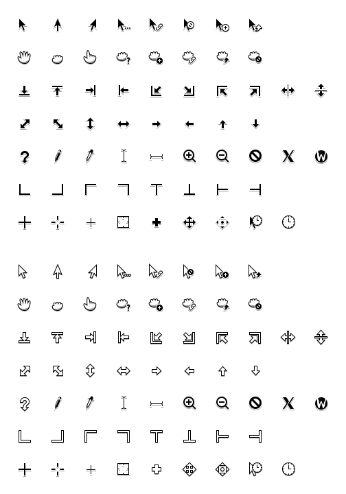

# Noir cursor theme

This cursor theme was made with multiple inspirations from multiple other cursor themes.

## Installation

1. Refer to the [releases](https://github.com/TDCMC/xcursor-noir/releases) section for download links.

2. Extract the archive.

3. Copy the "Noir" and "Noir White" directory to `~/.local/share/icons`

## Copying

Every part of this project is released under the [GNU General Public License version 3.0](https://www.gnu.org/licenses/gpl-3.0.txt) or [Creative Commons Attribution 4.0](http://creativecommons.org/licenses/by/4.0/) unless explicitly stated otherwise.
